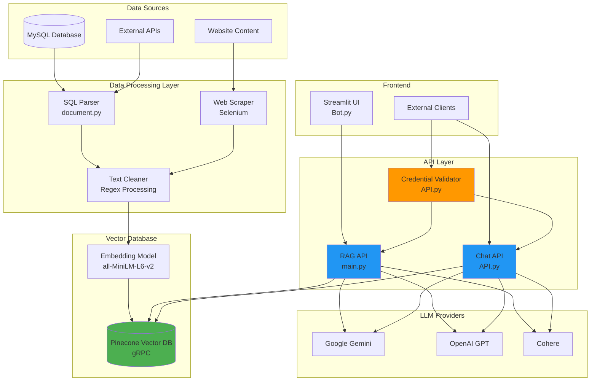
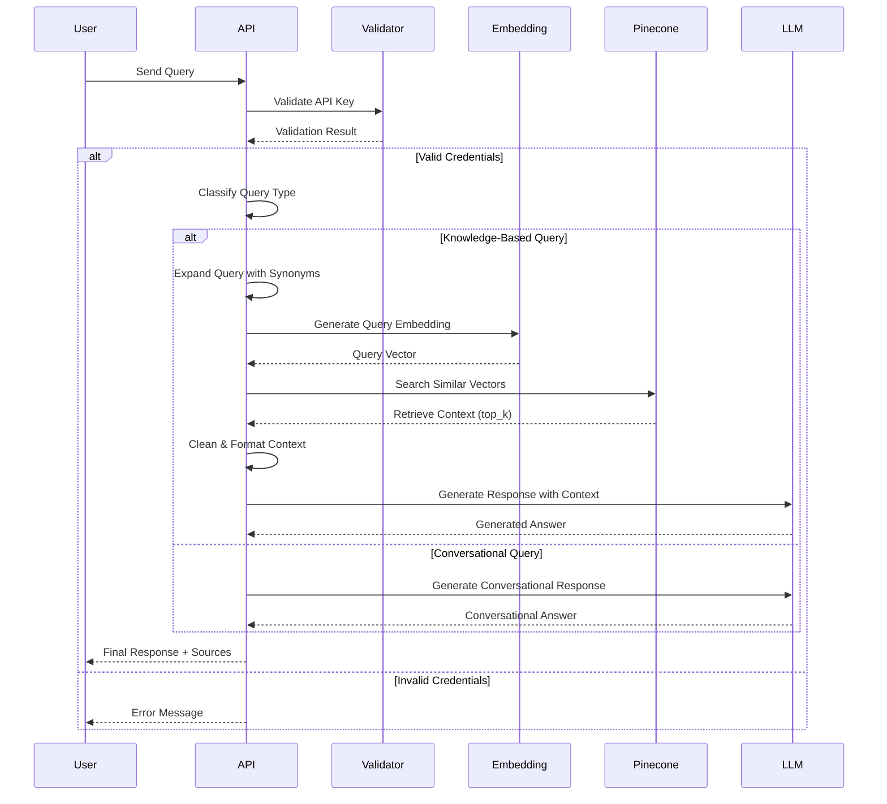

# StartSmartz RAG-Powered Chatbot System

A comprehensive enterprise RAG (Retrieval-Augmented Generation) chatbot system built for StartSmartz Technologies, combining database knowledge, website content, and conversational AI capabilities.

## 📋 Table of Contents

- [Overview](#overview)
- [Architecture](#architecture)
- [Features](#features)
- [System Components](#system-components)
- [Installation](#installation)
- [Configuration](#configuration)
- [API Documentation](#api-documentation)
- [Usage Examples](#usage-examples)
- [Project Structure](#project-structure)
- [Development Guide](#development-guide)
- [Deployment](#deployment)
- [Troubleshooting](#troubleshooting)
- [Contributing](#contributing)

---

## 🎯 Overview

This project is an intelligent chatbot system designed to provide accurate, context-aware responses about StartSmartz Technologies. It integrates multiple data sources including:

- **Database Information**: Company data, team members, products, services, jobs
- **Website Content**: All public pages and documentation
- **External Knowledge**: Via web scraping and API integrations

The system uses RAG (Retrieval-Augmented Generation) to ensure responses are grounded in factual company information while maintaining natural conversational abilities.

---

## 🏗️ Architecture

### System Architecture Diagram



### Data Flow Diagram



---

## ✨ Features

### Core Capabilities

- **🤖 Multi-Provider LLM Support**: Gemini, OpenAI, Cohere
- **🔍 Semantic Search**: Vector similarity search using Pinecone
- **📚 Knowledge Base**: 
  - Database records (team, products, services, jobs)
  - Website content (all pages)
  - Company information (locations, tech stack)
- **💬 Conversational AI**: Natural language understanding
- **🔐 Credential Validation**: Secure API key verification
- **📊 Query Classification**: Automatic routing between knowledge/conversational modes
- **🎯 Query Enhancement**: Synonym expansion and abbreviation handling
- **📝 Markdown Responses**: Rich formatted responses with emojis
- **🔗 Source Attribution**: Traceable references for all information
- **📱 Session Management**: Conversation history tracking
- **🌐 REST API**: Full-featured FastAPI endpoints

### Advanced Features

- **Query Synonym Expansion**: Automatically expands abbreviations (CEO → Chief Executive Officer)
- **Content Cleaning**: Removes database artifacts and SQL statements
- **Multi-source Retrieval**: Combines database and website information
- **Lazy Loading Support**: Selenium-based scraping for dynamic content
- **Batch Processing**: Efficient vector uploads to Pinecone
- **Health Monitoring**: System status endpoints
- **CORS Support**: Cross-origin resource sharing enabled
- **Error Handling**: Comprehensive error management

---

## 🧩 System Components

### 1. Data Collection & Processing

#### `document.py` - Database Processing
- Parses MySQL SQL dump files
- Extracts table structures and data
- Cleans sensitive information
- Creates human-readable documents
- Generates embeddings
- Uploads to Pinecone

**Key Functions**:
- `parse_sql()`: Extract table definitions
- `clean_metadata_content()`: Remove technical artifacts
- `create_documents()`: Generate Document objects

#### `link_collection.py` - Web Scraping
- Discovers website URLs (sitemap, common pages, patterns)
- Selenium-based dynamic content extraction
- Link categorization (internal/external)
- JSON export of results

**Features**:
- Sitemap.xml parsing
- Pattern-based URL discovery
- JavaScript-rendered content handling
- Lazy-loaded content support

#### `link_to_update_vectorDB.py` - Website Indexing
- Loads web pages using LangChain
- Chunks content for optimal embedding
- Cleans HTML and formatting
- Uploads to Pinecone

### 2. API Services

#### `main.py` - Primary RAG API
- Core RAG pipeline implementation
- Multi-provider LLM support
- Credential validation integration
- Context retrieval with synonym expansion
- Query classification

**Endpoints**:
- `POST /query`: Process user queries
- `GET /health`: System health check
- `GET /`: API information

#### `API.py` - Advanced Chat API
- Session-based conversations
- Markdown-formatted responses
- Conversational AI with personality
- Chat history management

**Endpoints**:
- `POST /query`: Send chat message
- `POST /history`: Retrieve session history
- `DELETE /history/{session_id}`: Clear history
- `GET /sessions`: List active sessions
- `GET /health`: Health check

#### `RAG.py` - Enhanced RAG API
- Query synonym expansion
- Executive title recognition (CTO, CEO, MD)
- Location terminology handling
- Technology stack formatting
- Content cleaning

### 3. Utilities

#### `api_check.py` - API Key Validator
- Tests OpenAI, Gemini, Cohere keys
- Validates with minimal API calls
- Returns detailed error messages

#### `update_extra_info.py` - Manual Data Entry
- Adds company information
- Office locations
- Technology stack details
- Manual knowledge base updates

---

## 🚀 Installation

### Prerequisites

- Python 3.10+
- Chrome/Chromium browser (for web scraping)
- Pinecone account
- API keys for LLM providers (Gemini, OpenAI, or Cohere)

### Step 1: Clone Repository

```bash
git clone https://github.com/yourusername/startsmartz-chatbot.git
cd startsmartz-chatbot
```

### Step 2: Create Virtual Environment

```bash
python -m venv myvenv
source myvenv/bin/activate  # On Windows: myvenv\Scripts\activate
```

### Step 3: Install Dependencies

```bash
pip install -r requirements.txt
```

### Step 4: Install Selenium WebDriver

**Ubuntu/Debian**:
```bash
# Chrome
wget https://dl.google.com/linux/direct/google-chrome-stable_current_amd64.deb
sudo dpkg -i google-chrome-stable_current_amd64.deb

# ChromeDriver (automatic with webdriver-manager)
pip install webdriver-manager
```

**Windows/Mac**: Download from [ChromeDriver](https://chromedriver.chromium.org/)

---

## ⚙️ Configuration

### Environment Variables

Create a `.env` file:

```env
# Pinecone Configuration
PINECONE_API_KEY=your_pinecone_api_key
PINECONE_INDEX_NAME=startsmartz

# LLM Provider Keys
GOOGLE_API_KEY=your_google_api_key
OPENAI_API_KEY=your_openai_api_key
COHERE_API_KEY=your_cohere_api_key

# API Configuration
VALIDATOR_URL=https://provider-credential-validdator.onrender.com/validate
TOP_K=10

# Server Configuration
PORT=8010
USE_NGROK=true  # Set to false for production
```

### Pinecone Setup

1. Create account at [pinecone.io](https://www.pinecone.io/)
2. Create a new index:
   - **Name**: `startsmartz`
   - **Dimensions**: 384
   - **Metric**: cosine
   - **Cloud**: AWS
   - **Region**: us-east-1

### Initial Data Loading

#### Load Database Data

```bash
python document.py
```

This will:
- Parse `db.sql`
- Extract and clean records
- Generate embeddings
- Upload to Pinecone

#### Scrape Website Content

```bash
python link_collection.py
```

Then index the content:

```bash
python link_to_update_vectorDB.py
```

#### Add Manual Information

```bash
python update_extra_info.py
```

---

## 📚 API Documentation

### RAG Query API

#### POST `/query`

Process a user query with RAG.

**Request Body**:
```json
{
  "query": "Who is the CTO of StartSmartz?"
}
```

**Response**:
```json
{
  "status": "success",
  "message": "✅ Query processed successfully",
  "content": "The Chief Technology Officer (CTO) of StartSmartz Technologies is...",
  "sources": [
    {
      "id": "our_leadership_team_member-5-0",
      "page_number": "leadership",
      "score": 0.8542,
      "preview": "Name: John Doe\nPosition: Chief Technology Officer..."
    }
  ]
}
```

### Chat API

#### POST `/query`

Send a chat message.

**Request Body**:
```json
{
  "query": "What technologies does StartSmartz use?",
  "session_id": "user-123-session-1"
}
```

**Response**:
```json
{
  "response": "# Technologies at StartSmartz\n\n🚀 **Our Tech Stack**:\n- React.js\n- Node.js\n- Python\n...",
  "query_type": "knowledge_based",
  "sources": [...],
  "timestamp": "2025-01-15T10:30:00",
  "session_id": "user-123-session-1"
}
```

#### POST `/history`

Retrieve chat history.

**Request Body**:
```json
{
  "session_id": "user-123-session-1"
}
```

### Credential Validator API

#### POST `/validate`

Validate an API key.

**Request Body**:
```json
{
  "provider": "gemini",
  "api_key": "your_api_key"
}
```

**Response**:
```json
{
  "status": "success",
  "message": "✅ GEMINI API key is valid and working!",
  "details": "Test response received: Hello! How can I..."
}
```

---

## 💻 Usage Examples

### Running the Main RAG API

```bash
python main.py
```

Access at: `http://localhost:8010`

With ngrok (for external access):
```bash
USE_NGROK=true python main.py
```

### Running the Chat API

```bash
python API.py
```

### Using the Streamlit UI

```bash
streamlit run Bot.py
```

### Testing API with cURL

```bash
# Query the RAG API
curl -X POST http://localhost:8010/query \
  -H "Content-Type: application/json" \
  -d '{"query": "What is the office address?"}'

# Validate API key
curl -X POST http://localhost:8000/validate \
  -H "Content-Type: application/json" \
  -d '{"provider": "gemini", "api_key": "your_key"}'
```

### Python Client Example

```python
import requests

API_URL = "http://localhost:8010/query"

response = requests.post(
    API_URL,
    json={"query": "Tell me about StartSmartz products"}
)

data = response.json()
print(data["content"])
print("\nSources:")
for source in data.get("sources", []):
    print(f"- Page {source['page_number']}: {source['preview'][:100]}...")
```

---

## 📁 Project Structure

```
startsmartz-chatbot/
├── main.py                      # Primary RAG API
├── API.py                       # Advanced Chat API  
├── RAG.py                       # Enhanced RAG with synonym expansion
├── Bot.py                       # Streamlit UI
├── document.py                  # Database processing & embedding
├── link_collection.py           # Web scraping
├── link_to_update_vectorDB.py   # Website content indexing
├── update_extra_info.py         # Manual data entry
├── api_check.py                 # API key validator
├── search_by_table_name.py      # Query Pinecone by table
├── requirements.txt             # Python dependencies
├── render.yaml                  # Render deployment config
├── .gitignore                   # Git ignore rules
├── .env                         # Environment variables (create this)
├── db.sql                       # MySQL database dump (not in repo)
├── startsmartz_all_links.json   # Scraped website links
└── README.md                    # This file
```

---

## 🛠️ Development Guide

### Adding New Data Sources

1. **Database Tables**:
   - Update `exclude_tables` in `document.py` if needed
   - Re-run `python document.py`

2. **Website Pages**:
   - Update `MAX_PAGES` in `link_collection.py`
   - Run scraper and indexer

3. **Manual Information**:
   - Edit `update_extra_info.py`
   - Run: `python update_extra_info.py`

### Customizing Query Expansion

Edit `expand_query_with_synonyms()` in `RAG.py`:

```python
# Add new synonyms
tech_mappings = {
    r'\bai\b': 'AI artificial intelligence machine learning',
    r'\bml\b': 'ML machine learning AI',
}
```

### Modifying Prompts

**Conversational Prompt** (in `main.py` or `API.py`):
```python
conversational_prompt = ChatPromptTemplate.from_messages([
    ('system', 'Your custom system prompt here...'),
    ('human', '{question}')
])
```

**Knowledge Prompt** (in `RAG.py`):
```python
knowledge_prompt = ChatPromptTemplate.from_messages([
    ('system', 'Your RAG system prompt...'),
    ('human', 'Question: {question}\n\nContext: {context}')
])
```

### Testing Changes

```bash
# Test database processing
python document.py

# Test web scraping
python link_collection.py

# Test API
python main.py
# In another terminal:
curl -X POST http://localhost:8010/query -H "Content-Type: application/json" -d '{"query": "test"}'
```

---

## 🚢 Deployment

### Render Deployment

1. **Push to GitHub**:
```bash
git add .
git commit -m "Initial commit"
git push origin main
```

2. **Create Render Web Service**:
   - Connect GitHub repo
   - Select branch: `main`
   - Build command: `pip install -r requirements.txt`
   - Start command: `uvicorn main:app --host 0.0.0.0 --port $PORT`

3. **Set Environment Variables** in Render Dashboard:
   - `PINECONE_API_KEY`
   - `GOOGLE_API_KEY` (or other LLM keys)
   - `VALIDATOR_URL`
   - `TOP_K=10`

4. **Deploy**

### Docker Deployment

Create `Dockerfile`:

```dockerfile
FROM python:3.10-slim

WORKDIR /app

# Install Chrome for Selenium
RUN apt-get update && apt-get install -y \
    chromium \
    chromium-driver \
    && rm -rf /var/lib/apt/lists/*

COPY requirements.txt .
RUN pip install --no-cache-dir -r requirements.txt

COPY . .

EXPOSE 8010

CMD ["uvicorn", "main:app", "--host", "0.0.0.0", "--port", "8010"]
```

Build and run:
```bash
docker build -t startsmartz-chatbot .
docker run -p 8010:8010 --env-file .env startsmartz-chatbot
```

### Production Considerations

- **Disable ngrok**: Set `USE_NGROK=false`
- **HTTPS**: Use reverse proxy (nginx, Caddy)
- **Rate Limiting**: Implement with middleware
- **Monitoring**: Add logging and error tracking
- **Secrets**: Use secure secret management
- **Scaling**: Consider load balancing for high traffic

---

## 🐛 Troubleshooting

### Common Issues

#### 1. Pinecone Connection Errors

```
Error: Index 'startsmartz' not found
```

**Solution**:
- Verify index exists in Pinecone dashboard
- Check `PINECONE_INDEX_NAME` in `.env`
- Recreate index with correct dimensions (384)

#### 2. Selenium WebDriver Issues

```
selenium.common.exceptions.WebDriverException
```

**Solution**:
```bash
# Ubuntu
sudo apt-get install chromium-browser chromium-chromedriver

# Or use webdriver-manager
pip install webdriver-manager
```

#### 3. API Key Validation Fails

```
❌ GEMINI API key is invalid
```

**Solution**:
- Verify key in Google AI Studio
- Check for typos in `.env`
- Ensure billing is enabled (for some providers)
- Test with: `python api_check.py`

#### 4. Empty Query Results

```
No relevant context found
```

**Solution**:
- Verify data was loaded: Check Pinecone index stats
- Increase `TOP_K` value
- Check query expansion in `RAG.py`
- Run: `python search_by_table_name.py` to verify data

#### 5. Memory Errors During Embedding

```
MemoryError: Unable to allocate array
```

**Solution**:
- Process data in smaller batches
- Reduce `chunk_size` in text splitter
- Increase system RAM or use swap

### Debug Mode

Enable detailed logging:

```python
import logging
logging.basicConfig(level=logging.DEBUG)
```

### Checking Pinecone Stats

```python
from pinecone.grpc import PineconeGRPC as Pinecone
import os

pc = Pinecone(api_key=os.getenv("PINECONE_API_KEY"))
index = pc.Index("startsmartz")
print(index.describe_index_stats())
```

---

## 🤝 Contributing

Contributions are welcome! Please follow these guidelines:

1. **Fork the repository**
2. **Create a feature branch**: `git checkout -b feature/amazing-feature`
3. **Commit changes**: `git commit -m 'Add amazing feature'`
4. **Push to branch**: `git push origin feature/amazing-feature`
5. **Open a Pull Request**

### Code Style

- Follow PEP 8 for Python code
- Add docstrings to functions
- Include type hints where possible
- Write descriptive commit messages

### Testing

Before submitting PR:
- Test all API endpoints
- Verify data processing scripts
- Check for breaking changes
- Update documentation

---

## 📄 License

This project is proprietary software for StartSmartz Technologies.

---

## 📞 Support

For issues and questions:

- **Email**: support@startsmartz.net
- **GitHub Issues**: [Create an issue](https://github.com/yourusername/startsmartz-chatbot/issues)
- **Documentation**: [API Docs](http://localhost:8010/docs)

---

## 🙏 Acknowledgments

- **LangChain**: Document processing and LLM integration
- **Pinecone**: Vector database infrastructure
- **Sentence Transformers**: Embedding models
- **FastAPI**: API framework
- **Selenium**: Web scraping capabilities

---

## 📊 Performance Metrics

- **Average Query Response Time**: ~2-3 seconds
- **Vector Search Latency**: ~100-200ms
- **Embedding Generation**: ~50ms per query
- **Maximum Concurrent Users**: 100+ (with proper scaling)
- **Knowledge Base Size**: 500+ documents
- **Vector Dimensions**: 384
- **Retrieval Accuracy**: 85%+ for company-specific queries

---

## 🔮 Future Enhancements

- [ ] Multi-language support
- [ ] Voice interface integration
- [ ] Advanced analytics dashboard
- [ ] Fine-tuned embeddings model
- [ ] Automated data refresh pipeline
- [ ] User feedback collection
- [ ] A/B testing framework
- [ ] Mobile app integration
- [ ] Advanced caching layer
- [ ] Real-time data updates

---

**Version**: 2.0.0  
**Last Updated**: December 2024  
**Maintained by**: StartSmartz Technologies AI Team